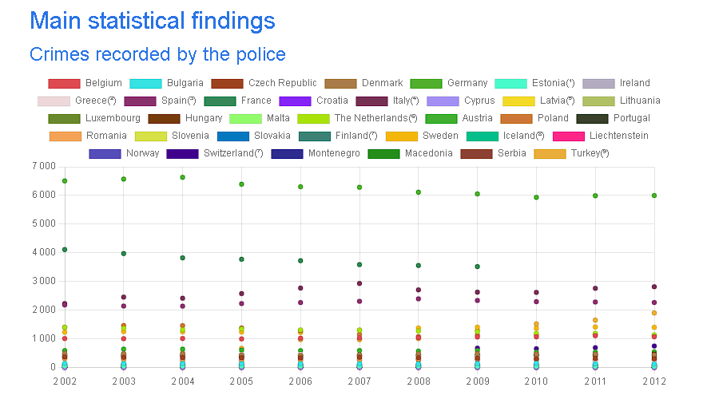
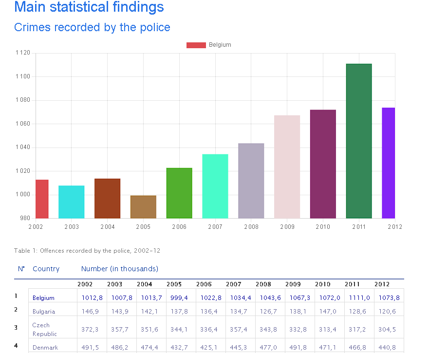
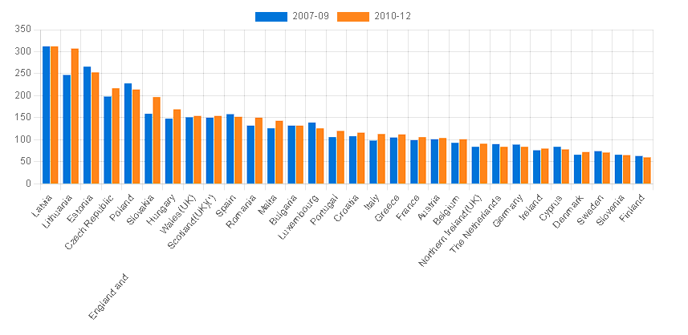

# Data visualisation :

## [Version WEB](https://cebe0210.github.io/js-datavisualisation-challenge/ "exerice chart.js")

## Context :

Cet exercice **JavaScript** est réalisée dans le cadre ma formation de Web Developpeur Junior chez [BeCode](https://becode.org/all-trainings/pedagogical-framework-junior-developer/ "site BeCode")

## Objectifs :

Ce challenge de consolidation vous aidera à évaluer votre capacité à résoudre un problème inspiré de situations réelles en utilisant vos nouveaux muscles javascript impliquant les savoir-faire suivants :

Manipulation du DOM
Requête AJAX / FETCH
Utilisation de bibliothèques tierces
résolution de problèmes : concevoir une solution logique pour mettre en œuvre le résultat attendu
Débogage à l'aide de la console
Comprendre la notion de « séparation des préoccupations »

## Votre mission :

Vous travaillez au sein du département Multimédia d'une des institutions de l'Union européenne. Ce matin, Johnny Hasnoclew, votre Project Manager, vous envoie en mission : l'un des journalistes internes a publié un nouvel article sur le site de l'institution. L'article en question est déjà intégré à un fichier html / css / Javascript .

Il vous demande de le rendre plus riche , plus interactif , plus... sexy (L'utilisation de cet adjectif spécifique indique que Johnny a certainement travaillé dans la publicité avant, le pauvre).

C'est exactement ce que vous allez faire, en ajoutant deux graphiques interactifs de visualisation de données à l'aide de javascript. Ces graphiques seront interactifs dans le sens où l'utilisateur pourra manipuler le graphique, comme filtrer les données, ou révéler des données détaillées lorsque la souris le survolera. Vous êtes libre de concevoir l’interaction dans votre projet.

1. Données en ligne (données dans le document)
Dans ce fichier html, vous trouverez deux tableaux de données. Utilisez JavaScript pour parcourir le DOM pour insérer juste au-dessus de chacun de ces tableaux une représentation de ses données sous la forme d'un graphique interactif.

Si javascript est désactivé, le graphique n'apparaît pas. Si javascript est activé, le graphique apparaît entre le titre et le tableau.

2. Données à distance, en temps réel, via ajax
Il y a des données à cette URL : https://canvasjs.com/services/data/datapoints.php

Récupérez les données via Ajax et utilisez-les pour insérer un graphique qui s'actualise toutes les secondes, juste en dessous du titre principal ( h1) de l'article.

N'hésitez pas à adapter le code fourni dans ce tutoriel : Live Updating Charts from JSON API & AJAX , mais adaptez-le à cette librairie tierce : chart.js ou ToastUi-Chart , car ce tutoriel en utilise une autre (non gratuite) bibliothèque (canvasJS).

Encore une fois : si javascript est désactivé, le graphique n'apparaît pas. Si javascript est activé, le graphique apparaît.

Comment allons-nous faire cela ?
Utilisez une bibliothèque javascript qui facilite cette tâche au lieu d'utiliser simplement "Vanilla Javascript" (= utiliser javascript sans bibliothèques). Si vous n'avez jamais codé en javascript avant BeCode, utilisez chart.js ou ToastUi-Chart . Si vous aviez déjà une bonne connaissance de Javascript avant de passer à BeCode, vous pouvez directement utiliser la bibliothèque D3.js - Data-Driven Documents , plus complexe mais offrant de nombreuses possibilités.
Formez-vous à leur utilisation.
Attaquez le problème en recherchant un bon chemin logique. Décomposez-le en petits problèmes , en étapes progressives . Engagez-vous à mesure que vous avancez. D'abord le DOM, accédez au bon endroit, puis récupérez les données, puis générez le graphique. Quelque chose comme ça 😉
Une méthode de réflexion : Reverse-engineering de votre objectif : commencer par la fin et remonter le fil des dépendances jusqu'au point de départ. Cela donne quelque chose comme ceci :
Pour avoir un graphique, vous avez besoin de données. Je dois donc les récupérer.
Où sont ces données ?
Pour avoir un graphique, je dois trouver le bon endroit dans le DOM, comment faire ?
Pour obtenir un graphique, j'utiliserai cette bibliothèque de visualisation de données . Comment ça marche?
...

## Contraintes :

Vous ne pouvez pas modifier le fichier html, sauf pour ajouter un fichier script.jspour charger votre js. Ne pas ajouter cssni modifier la structure duhtml
Vous avez le choix du type de graphisme. Considère les plus pertinentes en fonction des données et de l'histoire qu'elles peuvent « raconter ».
Le choix de la librairie javascript se limite aux 2 librairies proposées (il en existe bien d'autres, mais ce sont des références et sont très appréciées)

## Resultat :

### Tableau 1:

#### Comportement par **defaut**

#### Comportement **actif**

### Tableau 2 :

